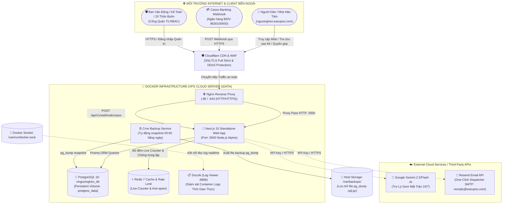

# QUỸ VÌ NGƯỜI NGHÈO XÃ EA SÚP - CỔNG THÔNG TIN & SAO KÊ MINH BẠCH

> **Cơ quan chủ quản:** Ban Thường trực Ủy ban Mặt trận Tổ quốc Việt Nam xã Ea Súp, tỉnh Đắk Lắk.  
> **Căn cứ pháp lý:** Quyết định số 13/QĐ-MTTQ-BTT (Quy chế vận động, quản lý Quỹ) & Quyết định số 12/QĐ-MTTQ-BTT (Thành lập Ban Vận động) ngày 14/01/2026.  
> **Tên miền chính thức:** `nguoingheo.easupso.com`

---

## 🏛️ THÔNG TIN PHÁP LÝ & TÀI KHOẢN TIẾP NHẬN DUY NHẤT

- **Thường trực Ban Vận Động:**
  - **Trưởng ban:** Đồng chí Lê Hồng Hạnh - Ủy viên Ban Thường vụ Đảng ủy, Bí thư Chi bộ MTTQ, Chủ tịch UBMTTQ Việt Nam xã Ea Súp.
  - **Phó ban:** Đồng chí Nguyễn Bá Bân - Chủ tịch UBND xã Ea Súp.
  - **Phó ban thường trực:** Đồng chí Nguyễn Thị Miên - Phó Chủ tịch Thường trực UBMTTQ xã, Chủ tịch Hội Nông dân xã.
  - **Cơ quan giúp việc:** Cơ quan Ủy ban MTTQ Việt Nam xã Ea Súp.
- **Địa bàn quản lý:** 20 thôn, buôn (17 thôn, 03 buôn: Buôn A2, Buôn Drai, Buôn Cổng) trên địa bàn xã Ea Súp.
- **TÀI KHOẢN TIẾP NHẬN DUY NHẤT:**
  - **Ngân hàng:** Ngân hàng TMCP Đầu tư và Phát triển Việt Nam (BIDV) - Chi nhánh / PGD Ea Súp.
  - **Số tài khoản:** `8630100930`
  - **Tên chủ tài khoản:** `UY BAN MTTQ VN XA EA SUP`
  - **Mã định danh ngân hàng (BIN):** `970418`
  - **Quy định bắt buộc:** Không sử dụng tài khoản tiền gửi Kho bạc Nhà nước. Toàn bộ dòng tiền tiếp nhận và đối soát thu chi trực tuyến được thực hiện 100% qua tài khoản BIDV 8630100930.

---

## 🚀 TÍNH NĂNG NỔI BẬT

1. **Trang chủ & Báo cáo thu chi (Live Ledger) theo mẫu hanhphucchomoinguoi.com:**
   - Bộ đếm thời gian thực (Live Counter): Tổng tiền ủng hộ (+), Tổng đã giải ngân (-), Số dư khả dụng thực tế (=), Số hộ được hỗ trợ.
   - Thẻ sao kê tài khoản BIDV 8630100930 với huy hiệu **"Chứng nhận bởi Casso"**.
   - Bảng kê chi tiết giao dịch trực tuyến với 3 tab: [ Tiền vào ] (Xanh lá), [ Tiền ra ] (Đỏ), [ Tất cả ].
   - Minh chứng giải ngân: Xem trực tiếp hóa đơn VAT vật tư, phiếu chi và biên bản nghiệm thu scan mộc đỏ.
2. **Widget Đóng góp VietQR NAPAS 247:**
   - Tự động sinh mã VietQR theo cú pháp chuẩn tiền tố: `VNN NDDK01 [Ho Ten]`, `VNN TET [Ho Ten]`, `VNN CT [Ho Ten]`.
   - Nút sao chép STK, nội dung chuyển tiền, tải ảnh mã QR.
3. **Trợ lý Trí tuệ Nhân tạo Google Gemini AI ("Gem Mặt Trận Ea Súp"):**
   - Hỗ trợ nhân dân và kiều bào tra cứu sao kê, chính sách, định mức và danh sách 20 thôn buôn 24/7.
4. **Phân hệ Quản trị (Admin Panel) & Phân quyền RBAC:**
   - `ADMIN`: Đồng chí Lê Hồng Hạnh (Chủ tịch UBMTTQ xã).
   - `ACCOUNTANT`: Kế toán Quỹ (Nhập liệu hồ sơ chi, upload chứng từ giải ngân).
   - `MONITOR`: 20 Trưởng ban CTMT thôn buôn.
5. **Nút Hành Động Đặc Biệt: `[ GỬI BÁO CÁO TOÀN HỆ THỐNG ]` (One-Click Dispatcher):**
   - 1-click phát tán email báo cáo số liệu tài chính thời gian thực qua Resend SMTP (`noreply@easupso.com`) tới Thường trực Đảng ủy, HĐND, UBND xã và 20 Trưởng ban CTMT.
6. **Xuất báo cáo đa định dạng:**
   - Xuất Excel sao kê BIDV 8630100930 chuẩn kế toán.
   - Xuất Word (.docx) chuẩn thể thức văn bản hành chính theo **Nghị định 30/2020/NĐ-CP**.

---

## 🏛️ KIẾN TRÚC HỆ THỐNG & DÒNG CHẢY DỮ LIỆU THỰC TẾ



---

## 🔌 TÍCH HỢP CASSO FLOW WEBHOOK V2 THỦ CÔNG

- **Endpoint:** `POST https://vinguoingheo.easupso.com/api/v1/webhook/casso`
- **Bảo mật:** Header `secure-token` và chữ ký HMAC-SHA512.
- **Idempotency:** Kiểm tra khóa chính `data.id`. Nếu giao dịch đã tồn tại, hệ thống trả về ngay HTTP 200 `{ "error": 0, "success": true }` để chống trùng lặp.
- **Xác thực STK:** Nghiêm ngặt kiểm tra `accountNumber === "8630100930"`.
- **CURL Mẫu Kiểm Thử Webhook:**
  ```bash
  curl -X POST https://vinguoingheo.easupso.com/api/v1/webhook/casso \
    -H "Content-Type: application/json" \
    -H "secure-token: EaSup_Charity_2026_Secure_Token_Secret" \
    -d '{
      "error": 0,
      "data": {
        "id": 102458,
        "reference": "BIDV_FT262391001",
        "description": "VNN NDDK01 NGUYEN VAN A UNG HO",
        "amount": 5000000,
        "runningBalance": 450000000,
        "transactionDateTime": "2026-09-10 11:10:00",
        "accountNumber": "8630100930",
        "bankName": "BIDV",
        "bankAbbreviation": "BIDV"
      }
    }'
  ```

---

## 📦 QUY TRÌNH PUSH MÃ NGUỒN LÊN GITHUB

1. **Khởi tạo và commit mã nguồn cục bộ:**
   ```bash
   git init
   git branch -M main
   git add .
   git commit -m "feat: initial commit - WebApp Quy vi nguoi ngheo Ea Sup fullstack with Docker"
   ```

2. **Kết nối Remote GitHub của bạn:**
   ```bash
   git remote add origin https://github.com/<GITHUB_USERNAME>/<REPO_NAME>.git
   git push -u origin main
   ```

3. **Cấu hình GitHub Secrets để kích hoạt CI/CD tự động deploy VPS:**
   Truy cập: `GitHub Repo -> Settings -> Secrets and variables -> Actions`:
   - `VPS_HOST`: Địa chỉ IP tĩnh VPS Cloud Server Gdata
   - `VPS_USERNAME`: `root` (hoặc user quản trị VPS)
   - `VPS_SSH_KEY`: Private Key SSH của bạn
   - `VPS_PORT`: `22`

---

## 🖥️ QUY TRÌNH DEPLOY LÊN CLOUD SERVER GDATA (1-CHẠM)

1. **Đăng nhập vào VPS của bạn qua SSH:**
   ```bash
   ssh root@<IP_VPS>
   ```

2. **Tải và thực thi kịch bản cài đặt tự động:**
   ```bash
   # Cách 1: Tải trực tiếp script
   curl -sSL https://raw.githubusercontent.com/lehanhkt01-gif/nguoingheo/main/deploy-vps.sh | sudo bash

   # Cách 2: Clone repository và chạy deploy-vps.sh
   mkdir -p /var/www/nguoingheo
   cd /var/www/nguoingheo
   git clone https://github.com/lehanhkt01-gif/nguoingheo.git .
   chmod +x deploy-vps.sh
   sudo bash deploy-vps.sh
   ```

3. **Cấu hình Tên miền & Cloudflare SSL:**
   - **DNS Records:** Thêm bản ghi `A` trỏ tên miền `nguoingheo.easupso.com` về địa chỉ IP của VPS.
   - **Proxy Status:** Bật biểu tượng đám mây màu cam (Proxied) để kích hoạt WAF chống DDoS.
   - **SSL/TLS Mode:** Chọn **Full** hoặc **Full (Strict)**.

---

## 👥 THÔNG TIN TÀI KHOẢN NỘI BỘ MẶC ĐỊNH

- **Trang đăng nhập:** `https://nguoingheo.easupso.com/admin/login`
- **Tài khoản Admin (Chủ tịch UBMTTQ xã):** `lehonghanh` / `EaSup@2026`
- **Tài khoản Kế toán Quỹ:** `ketoan_mttq` / `EaSup@2026`
- **Tài khoản Trưởng ban CTMT Buôn Drai:** `ctmt_buondrai` / `EaSup@2026`
