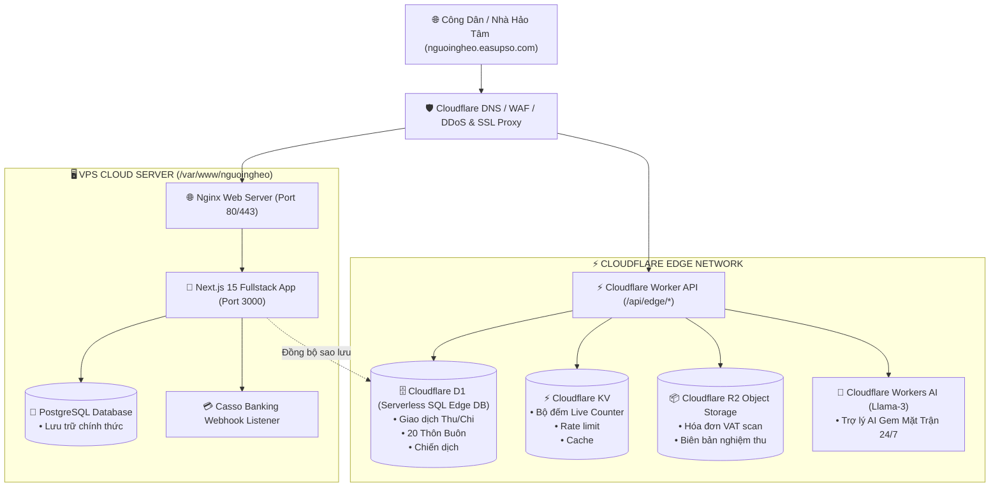

# 🏛️ KIẾN TRÚC HỆ THỐNG DATABASE & DỊCH VỤ CLOUDFLARE
## NỀN TẢNG MINH BẠCH QUỸ VÌ NGƯỜI NGHÈO XÃ EA SÚP
**Tên miền chính thức:** `nguoingheo.easupso.com`  
**Cơ quan chủ quản:** Ban Thường trực Ủy ban MTTQ Việt Nam xã Ea Súp, tỉnh Đắk Lắk  
**Tài khoản tiếp nhận duy nhất:** BIDV `8630100930`

---

## 📊 1. SƠ ĐỒ TỔNG THỂ CÁC ỨNG DỤNG CLOUDFLARE



---

## 💎 2. VAI TRÒ CỤ THỂ CỦA TỪNG ỨNG DỤNG CLOUDFLARE

### 1. Cloudflare D1 (Cơ sở dữ liệu quan hệ Serverless SQL)
* **Vị trí file:** `cloudflare/d1/schema.sql` & `cloudflare/d1/seed.sql`
* **Nhiệm vụ:**
  * Lưu trữ quan hệ dữ liệu có cấu trúc: Bảng `villages` (20 thôn buôn), bảng `campaigns` (chiến dịch), bảng `transactions` (sao kê ngân hàng BIDV), bảng `disbursement_proofs` (minh chứng chi), bảng `audit_logs` (nhật ký kiểm toán).
  * Cho phép truy vấn siêu tốc tại các node mạng Edge của Cloudflare gần người dùng nhất mà không gây tải cho máy chủ VPS.

### 2. Cloudflare KV (Lưu trữ Key-Value siêu tốc)
* **Nhiệm vụ:**
  * Cache số liệu bộ đếm thời gian thực `live_fund_stats` (Tổng thu `334.000.000 đ`, đã giải ngân `33.000.000 đ`, dư `301.000.000 đ`).
  * Giảm tải 99% truy vấn database khi có hàng nghìn người cùng xem sao kê.
  * Chống tấn công lặp yêu cầu (Rate Limiting & Webhook Deduplication).

### 3. Cloudflare R2 (Lưu trữ chứng từ hóa đơn - Không tính phí băng thông ra)
* **Bucket name:** `nguoingheo-proofs`
* **Nhiệm vụ:**
  * Chứa các file ảnh scan mộc đỏ, phiếu chi `PC-2026-0042`, hóa đơn VAT vật liệu xây dựng nhà Đại đoàn kết, biên bản khởi công có chữ ký Trưởng ban CTMT các thôn/buôn.
  * Miễn phí hoàn toàn băng thông tải xuống (Egress Fees = $0).

### 4. Cloudflare Workers AI & Vectorize (Trí tuệ nhân tạo Trợ lý Mặt trận)
* **Model:** `@cf/meta/llama-3-8b-instruct`
* **Nhiệm vụ:**
  * Vận hành Chatbot `Gem Mặt Trận Ea Súp` trả lời tự động cho công dân về định mức chi theo QĐ 13/QĐ-MTTQ, địa bàn 20 thôn buôn, tra cứu giao dịch BIDV 24/7.

### 5. Cloudflare DNS & SSL Full (Bảo mật & Tên miền)
* **Bản ghi DNS:**
  * Bản ghi `A` trỏ `nguoingheo.easupso.com` về IP VPS với chế độ **Proxied (Đám mây cam bật)**.
* **SSL/TLS:** Thiết lập chế độ **Full (Strict)** để mã hóa đầu cuối 100% giữa Cloudflare và VPS.

---

## 🚀 3. HƯỚNG DẪN TRIỂN KHAI LÊN VPS (`/var/www/nguoingheo`)

Trên máy chủ VPS Ubuntu, chạy 1 dòng lệnh duy nhất để tải mã nguồn và cài đặt tự động:

```bash
# Đăng nhập SSH vào VPS
ssh root@<IP_VPS_CỦA_BẠN>

# Tải và chạy kịch bản triển khai tự động
curl -sSL https://raw.githubusercontent.com/lehanhkt01-gif/nguoingheo/main/deploy-vps.sh | sudo bash
```

Toàn bộ ứng dụng sẽ tự động được thiết lập tại thư mục: **`/var/www/nguoingheo`**.
